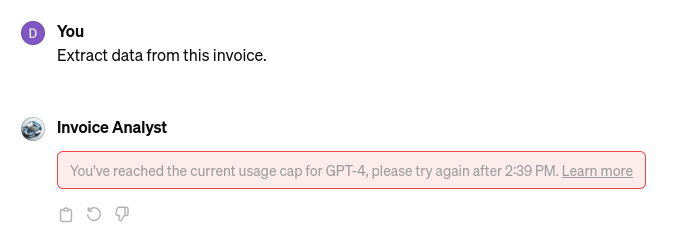

# Invoice analyst

## LlamaParse

LlamaParse had a good performance extracting and parsing inovices to provide structured output data.

From the repository:

> LlamaParse is an API created by LlamaIndex to efficiently parse and represent files for efficient retrieval and context augmentation using LlamaIndex frameworks.

What LlamaIndex has done is created an API Endpoint that we can access (currently for free up to 10,000 pages of PDFs a day) that will parse out PDF files into either plain-text or markdown. That second one means we have a way to retain structural data that can be leveraged for more structural queries!

## Training of custom GPT

I specified to add the fields subtotal, IVA and other taxes and check that they match the total.

Sometimes the calculation is not accurate so I told the assistant to use an external tool. It then appeared to do the calculation correctly.

At 12:33 pm it told me to wait more than 2 hours to use the service again.

I uploaded a new invoice which does not have IVA, I have to update the GPT to indicate that "C" type invoices do not have IVA.

Also the CUIT of the invoice issuer was not correctly identified. Instead the CUIT of MZP was returned as the CUIT of the issuer.

Sometimes it tells me that it is unable to extract information from a pdf.

PDF's appear to work ok.

Images are harder to analyze. It uses the tool pytesseract as an OCR:

    extracted_text = pytesseract.image_to_string(invoice_image)

It timed out with these messages:

> *"I’ll analyze the image of the invoice you've uploaded and provide you with the extracted data. Let's get started."*

> *"The OCR process took longer than expected and was interrupted. This can occasionally happen with images that are large or have complex layouts. I'll try a different approach to extract the information. Let's give it another shot."*

I will have to process the documents first with an OCR or a PDF extractor.

## MMOCR

I was able to process the invoice using the SDMGR model:

    from mmocr.apis import MMOCRInferencer
    infer = MMOCRInferencer(det='dbnetpp', rec='svtr-small', kie='SDMGR')
    result = infer('/home/dario/Dropbox/ai/ocr_dario/out0126.jpg', save_vis=True)

It did not recognize the comma as decimal separator
I won't spend time time on the OCR challenge. I will start with pdf's with text.

